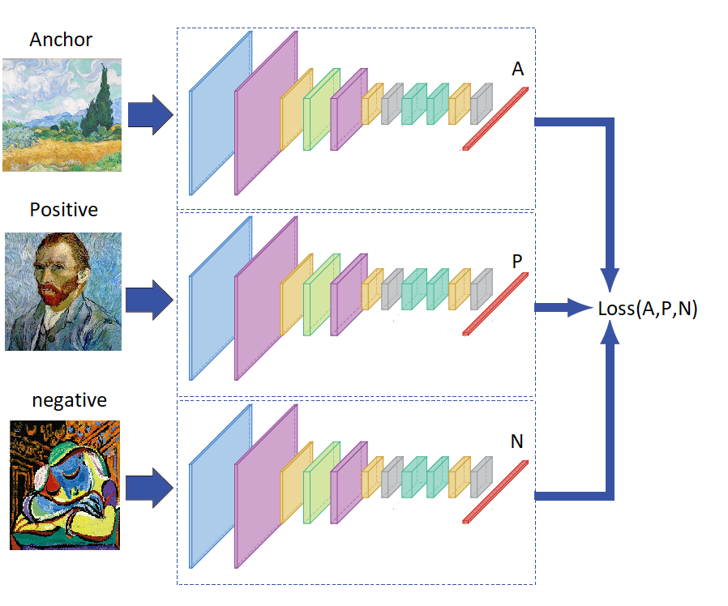

# PainterByNumber

Hello all,

This is my solution to the Kaggle competition PainterByNumbers: https://www.kaggle.com/c/painter-by-numbers

The goal of the competition is to build a network that learns artists' painting style. 

Example: left and middle paintings are Van Gogh's, while the right painting is Picasso's.   

  
   
  

  

# Approach: Siamese CNN network with triplet approach
Siamese CNN consists of three (or two incase of contrastive approach) Convolutional Neural Networks where **weights are shared** between the CNNs.  
First input goes through the CNN to produce a feature vector, then the second and the third go throught the **same** CNN.    
The fist image we term Anchor, this painting belongs to artist1.     
The second image we term Positive, it is a **different** painting of the **same** artist1.  
The third image we term Negative is a painting of a **different** artist2.    
**Note: The two artists and paintings in each step are all randomly chosen.**  

The loss is then calculated on the three feature vectors produced and gradients are calculated aon shared weights.  
The aim of the network is to make feature vectors of paintings of same artists' closer to each other while feature vectors of paintings of different artists are pushed away.  

  

  
  
**Contrastive network**: I've also exprimented with two CNNs (instead of three, still with **shared weight** between the two CNNs). For this, a contrastive loss was used. In this network, two paintings and a label are given and the goal is to push their feature vectors closer if the label=0 (paintings are from the same artist) or push ehir feature vectors far from each other incase the label=1 (paintings are from different artists).   
In each step, we first randomly choose label=(0,1) and then randomly choose paintings based on the label (if label=0 we randomly choose an artist, then randomly choose two of his paintings. If label=1, we randomly choose 2 artits and randomly choose a painting of each of them). The label is saved with the pair (see contrastive loss below).  

  
  

# The architechture:
The input image is of size 256x256x3.  
The shared CNN consists of 5 convolutional blocks, each block is followed by a maxpool(2) - the sizes of the images after each block is shown below. The number of conv2d in each block is marked below each block in conv2d-xN. Each conv2d is followed by a BatchNorm and a Relu activation. The output feature vector is of size 2048.

  

(the architecture figure was drawn with this online tool: http://alexlenail.me/NN-SVG/LeNet.html)

  
  
  
# The loss:
**Triplet loss:**  
The aim of the triplet loss is to push feature vectors of Anchor and Positive paintings closer to each other pushing them away from the feature vector of the Negative painting. (A default margin=2).

  

**Contrastive loss:**  
As mentioned above, I've expiremented with a two CNN arhictecture where only two paintings and a label Y are handled. The aim is to push their feature vectors closer if the label Y=0 or push them apart if Y=1.

  

**I think the triplet approach is much stronger as it does what the contrastive approach does and more.**   
**Nevertheless, my code has the two approaches and can be switched with a simple flag *pair_triplet* ( False=contrastive ; True=Triplet).**  

# Data cleaning and preprocessing:
First, I've divided the paintings to classes based on artists. Then eliminated artists who had only one painting, this was done after noticing that some classes (artists) are not even artists (they had names of paintings) - it is clearly a mistake in data collection.  
After cleaning, the dataset has 1701 artists, each with at least two paintings.
Second, the dataset artists were divided to **training** (80%) and **test** (20%). A fraction (10%) from training paintings was saved for **validation**.    
**The test set has only artists not seen in training (not one painting of theirs)!**  
**The validation set has paintings not seen in training, but the artists who painted them are in the training.**  

The number of paintings per artist are different and shown below (ordered):  

  

