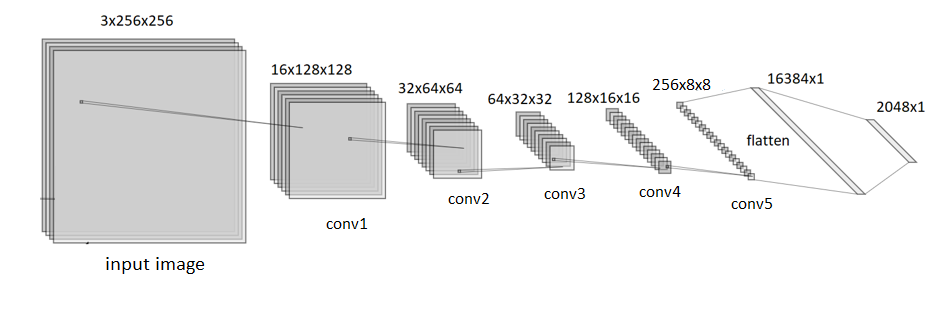

# PainterByNumber

Hello all,

This is my solution to the Kaggle competition PainterByNumbers: https://www.kaggle.com/c/painter-by-numbers

The goal of the competition is to build a network that learns artists' painting style. 

Example: left and middle paintings are Van Gogh's, while the right painting is Picasso's.   

  
   
  

  

# Approach: Siamese CNN network with triplet loss
Siamese CNN consists of three Convolutional Neural Networks where **weights are shared** between the CNNs.  
Basically, first input goes through the CNN to produce a feature vector, then the second and the third go throught the same CNN.    
The fist image we term Anchor, this painting belongs to artist1.     
The second image we term Positive, it is a **different** painting of the **same** artist1.  
The third image we term Negative is a painting of a **different** artist2.    
The loss is then calculated on the three feature vectors.    

The aim of the network is to make feature vectors of paintings of same artists' closer to each other while feature vectors of paintings of different artists are pushed away.  

  

**Contrastive network**: I've also exprimented with two CNNs (instead of three, still with **shared weight** between the two CNNs). For this, a contrastive loss was used. In this network, two paintings of different artists are given and the goal is to push their feature vectors far from each other. 
I think the triplet approach is much stronger as it does what the contrastive approach does and more. 
Nevertheless, my code has the two approaches and can be switched with a simple flag **pair_triplet** ( False=contrastive ; True=Triplet). 
.

# The architechture:
The input image is of size 256x256x3.  
The shared CNN consists of 5 convolutional blocks, each block is followed by a maxpool(2) - the sizes of the images after each block is shown below.  
The number of conv2d in each block is marked below each block in conv2d-xN. Each conv2d is followed by a BatchNorm and a Relu activation.

  

# The loss:
**Triplet loss:**  

